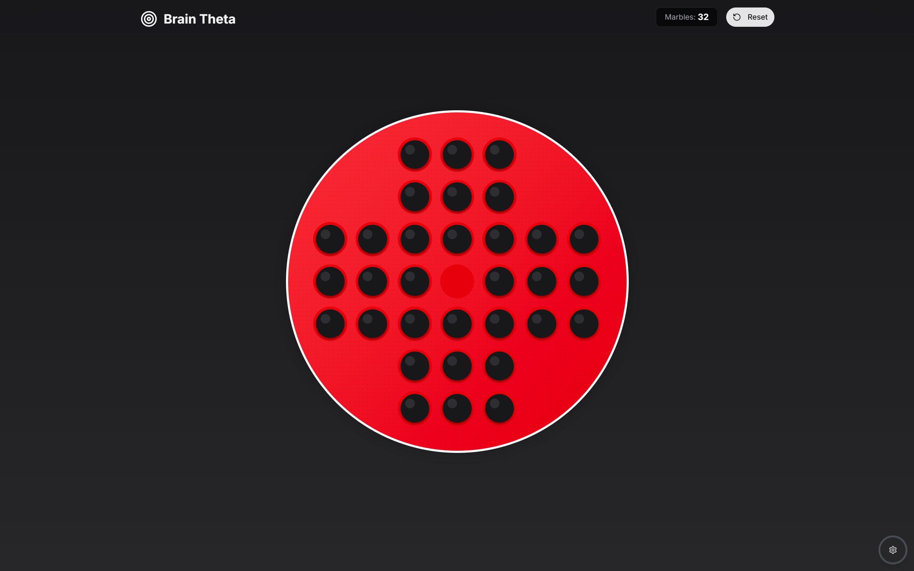

# 🧠 Brain Theta - Peg Solitaire

Brain Theta is a minimalistic and responsive **Peg Solitaire** game built with [Next.js](https://nextjs.org/), [Tailwind CSS](https://tailwindcss.com/), and [TypeScript](https://www.typescriptlang.org/). The goal is to leave only one marble by jumping over others, just like the classic puzzle.

## 🚀 Features

- 🎮 Interactive gameplay with clean UI
- 🌙 Light and Dark mode support
- 📱 Fully responsive across devices
- ⚡ Smooth animations via Framer Motion
- ✅ Built using modern web stack (Next.js 14, Tailwind CSS, TypeScript)

## 📸 Preview

## 🧩 How to Play

### 🎯 Objective:

Eliminate as many marbles as possible by jumping over them. The goal is to finish with only **one marble** left on the board.

### 🎮 Gameplay Rules:

1. **Select a Marble**: Click on a marble to select it.
2. **Make a Move**: Jump it over an **adjacent marble** (up, down, left, or right) into an **empty hole**.
3. **Marble Removal**: The marble that was jumped over will be removed from the board.
4. **Continue**: Keep making valid moves until no more moves are available.

### ✅ Valid Moves:

- Only **horizontal or vertical** jumps are allowed.
- Diagonal moves are **not allowed**.
- You must jump **exactly one adjacent marble** into an empty space.

### 🏆 Winning:

You win the game if you manage to leave **exactly one marble** on the board.
